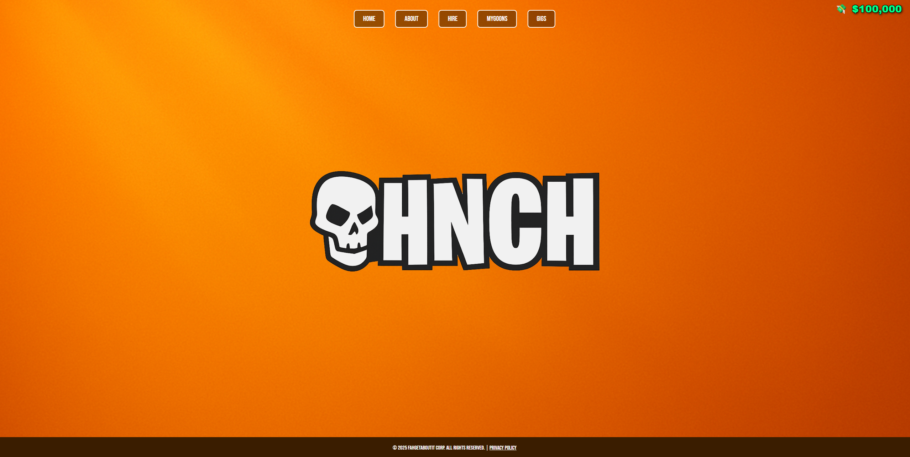
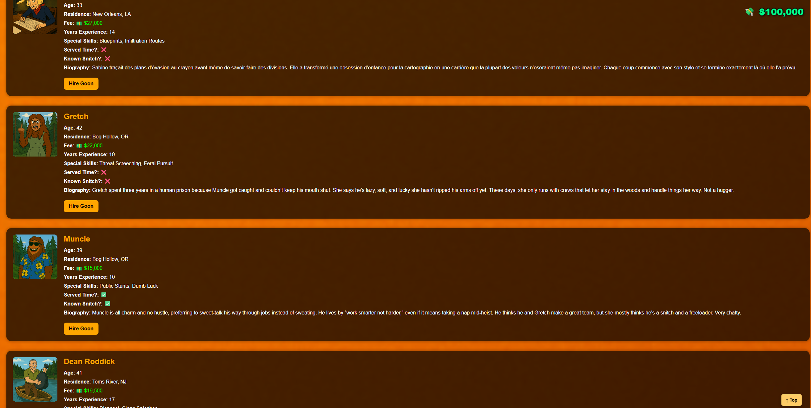
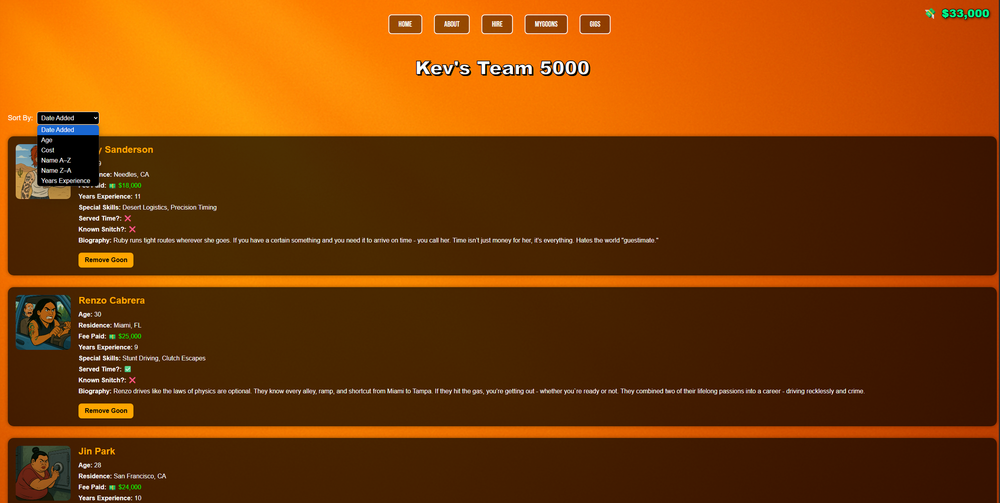
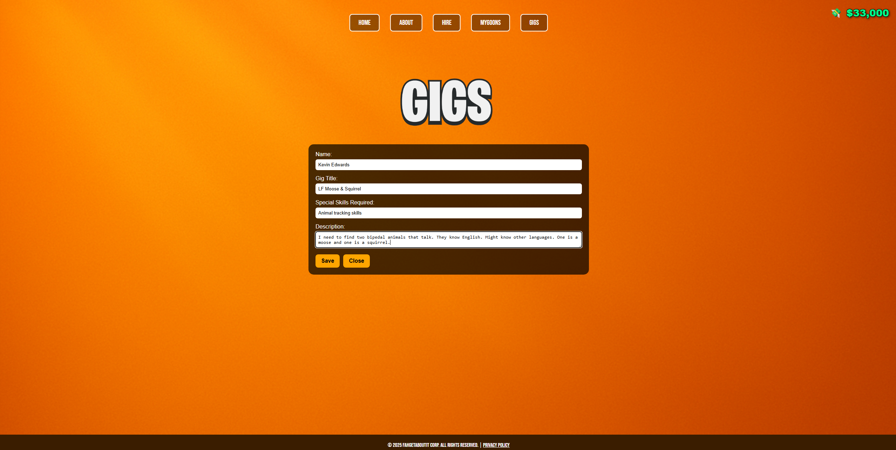

# kevolution82.github.io-

Kevin Edwards - Professional Portfolio
Welcome to my professional portfolio. I am an aspiring software developer who enjoys making fun, interactive software.

About Me
I have experience with HTML, CSS, JavaScript, React, Node.js, Git and GitHub, and some MySQL. I want to work as a software developer, especially with projects that support the entertainment industry and, of course, creative people.

Resume and Achievements
[Download Resume (PDF)](https://github.com/kevolution82/kevolution82.github.io-/blob/main/launchcode-resume-2025)

Festival Director for the Always Late TV Movie Awards
Filmmaker for 13 years
Freelance graphic designer for 20 years

Project Work
Full Stack Project
Name: HNCH
Description: A web app that makes it easy for villains to hire goons.
[Click to view project.](https://hnch-app.netlify.app/)

Contact
[Email Me](mailto:alwayslatetv@yahoo.com)
[Connect on LinkedIn](https://www.linkedin.com/in/kevinedwards82/)
